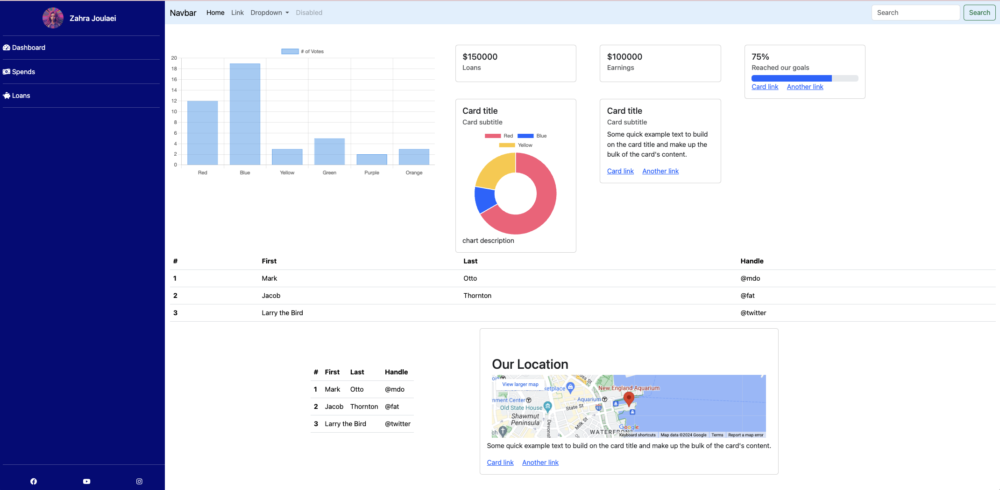
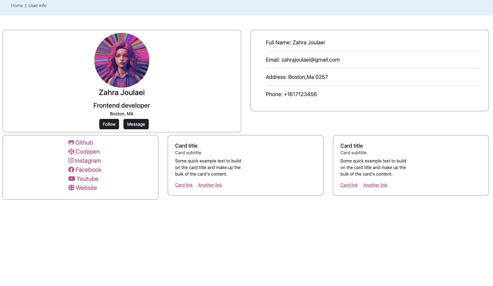
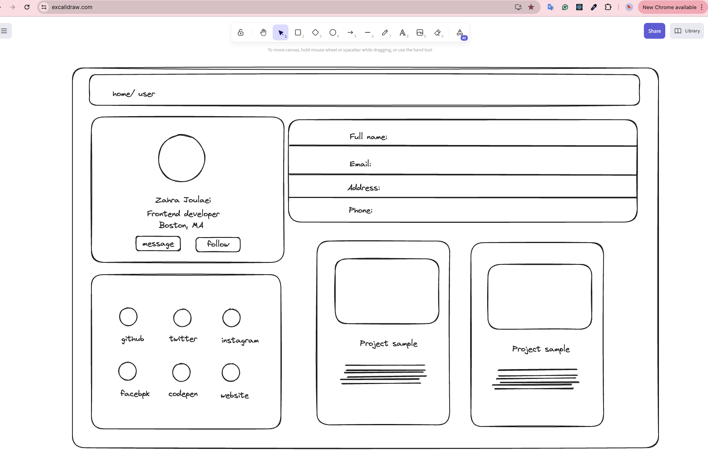
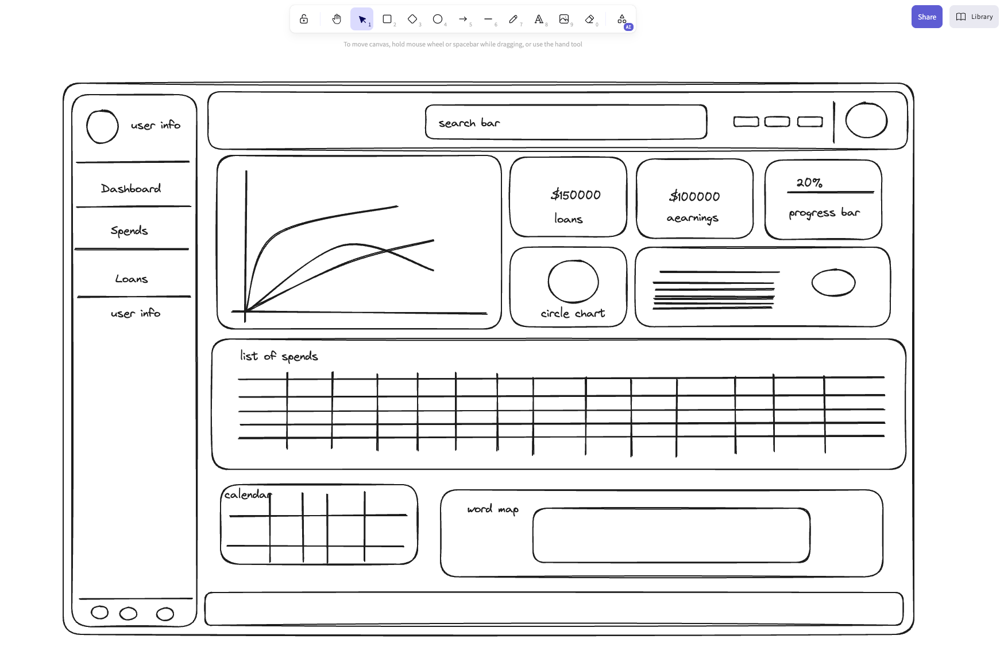

# Dashboard Bootstrap Project

## Overview

This project is a Bootstrap-based dashboard created as a task for the Perscholas team. The task involved creating wireframes and then developing the dashboard page and user page based on those wireframes.

## Wireframes

The wireframes were created using [Excalidraw](https://excalidraw.com/). They provided the blueprint for the structure and layout of the dashboard and user pages.

## Features

- **Bootstrap**: Utilized for responsive and modern design.
- **Chart.js**: Integrated for creating interactive and visually appealing charts. [chartjs](https://www.chartjs.org/).

## Pages

- **Dashboard Page**: Provides an overview of key metrics and charts.
- **User Page**: Displays user-related information and statistics.

## Screenshots


### Dashboard Page


### User Page


### Wireframes



## Installation

1. **Clone the repository**:
    ```sh
    git clone https://github.com/zahrajoulaei/admin-dashboard
    ```

2. **Navigate to the project directory**:
    ```sh
    cd admin-dashboard
    ```

3. **Open the project in your browser**:
    Open `index.html` in your web browser to view the dashboard.
   you can navigate to the user profile by clicking the user name from the side menu


## Contact

For any inquiries or feedback, please contact [zahrajoulaei@gmail.com](mailto:zahrajoulaei@gmail.com).
